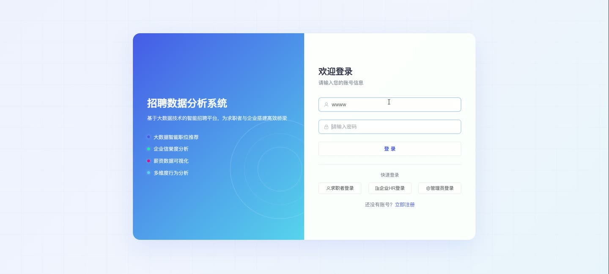
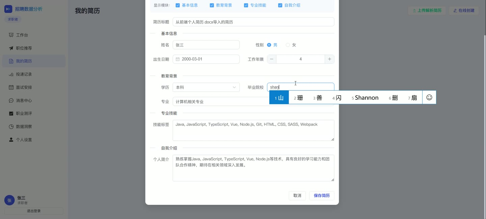
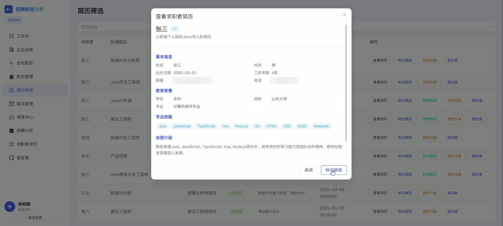
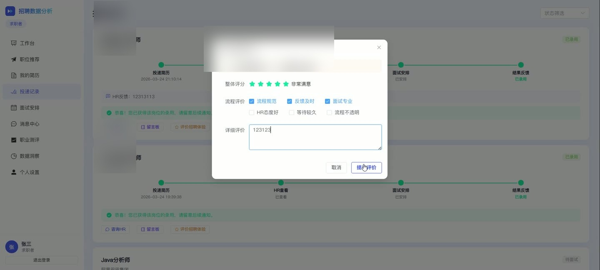
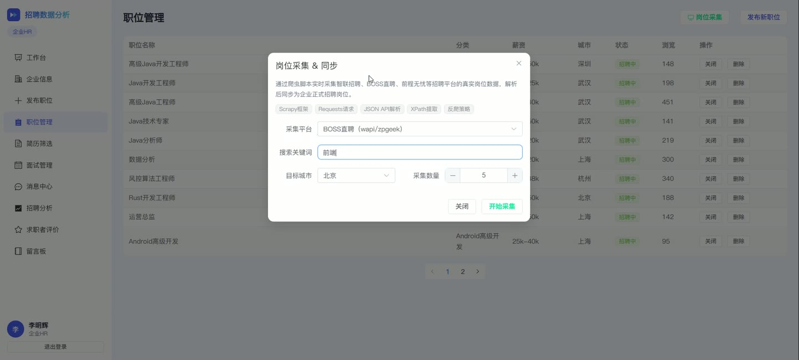
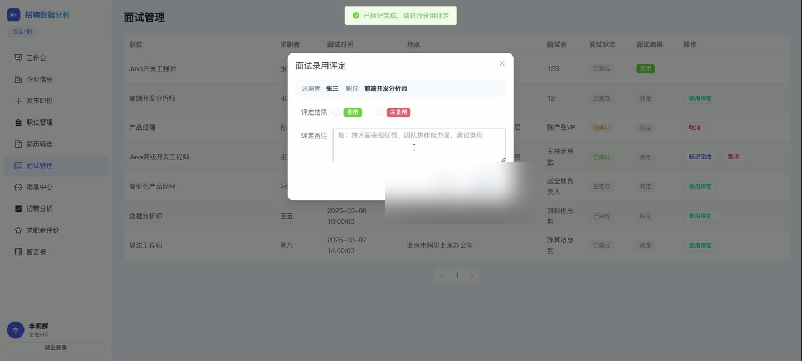

# (附文档)Python+Django+Vue3 招聘数据分析系统

**技术栈**：Python、Django、Vue3、PostgreSQL

### 系统简介

本系统是一套基于 Python + Django + Vue3 的招聘数据分析平台，采用前后端分离架构，后端提供 RESTful 接口，前端为单页应用。系统覆盖求职者、企业HR、管理员三类角色，围绕职位招聘、简历投递、面试管理、企业审核与多维度数据分析展开，内置爬虫数据管理与可视化看板。
 
### 核心功能
 
### 普通用户端（求职者）

 
- 账号注册与登录：填写用户名、密码、邮箱、手机号完成注册，登录后获取 Token 并写入本地存储。 
- 个人资料维护：修改邮箱、手机号、真实姓名，上传头像文件并返回访问地址。 
- 修改密码：校验原密码后更新为新密码，原密码错误时返回提示。 
- 职位搜索：按关键词、城市、分类、经验、学历、职位类型、薪资区间、企业 ID 组合筛选，支持分页。 
- 职位详情浏览：查看职位描述与任职要求，自动累加浏览量并写入浏览记录。 
- 简历管理：创建、编辑、删除简历，支持设置默认简历，投递时自动使用默认简历。 
- 简历文件上传与解析：上传 PDF/Word 文件，自动提取姓名、学历、学校、专业、工作年限、技能、性别并生成自我介绍摘要。 
- 简历复制：按目标岗位复制生成新版本简历，版本号自增。 
- 职位投递：选择职位与简历提交投递，系统校验重复投递并记录投递状态。 
- 投递记录查看：按状态筛选本人投递记录，查看 HR 备注与处理进度。 
- 面试管理：查看本人面试安排，确认、取消或响应 HR 提议的面试时间。 
- 站内消息：查看与联系人之间的消息列表，标记已读状态。 
- 留言板：针对投递记录与 HR 进行留言沟通。 
- 职位推荐：基于浏览历史的职位分类推荐高浏览量职位。 
- 需求推荐：依据默认简历的技能、学历、经验年限反向匹配在招职位，输出匹配分与匹配原因。 
- 薪资参考：按分类与城市查询职位薪资均值。 
- 浏览历史：分页查看本人浏览过的职位记录。 
- 职业测评：提交测评类型并查看本人测评结果与建议。 
- 求职者数据看板：展示投递总数、待处理数、面试数、录用数、浏览数。 
- 企业评价：查看企业详情页的用户评分与评价内容。
 
### 企业HR端

 
- 企业入驻：提交企业名称、行业、规模、地址、城市、简介、Logo、营业执照、法人信息与招聘许可证明，状态为待审核。 
- 企业资料维护：审核通过前可修改企业资料，被驳回后可修改并重新进入待审核状态。 
- 发布职位：在企业审核通过后发布职位，填写职位名称、分类、薪资区间、城市、经验、学历、描述、要求、类型。 
- 职位管理：分页查看本企业职位列表，编辑职位字段，删除本企业职位。 
- 投递处理：查看本企业所有投递记录，按状态筛选，更新投递状态并填写 HR 备注。 
- 面试管理：查看本人负责的面试，更新面试状态、时间、地点、面试官、结果与备注。 
- 站内消息：与求职者进行消息往来，查看联系人列表。 
- 留言板：查看并回复投递记录下的求职者留言。 
- 企业评价查看：查看本企业收到的用户评分与评价内容。 
- HR 数据看板：展示本企业职位总数、在招职位、投递总数、待处理投递、面试总数、待确认面试、企业信誉分。 
- 招聘分析：按职位统计投递量，统计投递状态分布与面试状态分布。
 
### 管理员端

 
- 用户管理：分页查看用户列表，按角色与用户名关键词筛选，启用或禁用指定用户。 
- 企业审核：查看全部企业并按状态筛选，审核通过或驳回企业，填写驳回原因并记录审核时间。 
- 信誉评分管理：为企业设置信誉评分，用于企业排序与推荐加权。 
- 职位管理：查看并编辑任意职位，删除违规职位。 
- 公告管理：发布、编辑、删除公告，设置分类、置顶、状态与过期时间。 
- 爬虫数据管理：分页查看抓取职位数据，按来源与是否清洗筛选。 
- 爬取同步：触发爬取数据的同步入库操作。 
- 职业测评查看：查看全部用户提交的职业测评记录。 
- 平台数据总览：统计用户总数、求职者数、HR 数、在招职位数、已通过企业数、投递数、面试数、抓取数据数、待审核企业数。 
- 平台概览分析：按角色统计用户分布，统计投递状态分布，汇总企业、职位、面试、评价总量。 
- 薪资分析：按城市与分类统计平均最低薪资、平均最高薪资与职位数量。 
- 职位趋势：统计近 30 天每日职位发布数量。 
- 求职者行为分析：统计浏览职位按分类与城市的分布，以及投递状态分布。 
- 企业信誉分析：输出企业信誉分、评价数、平均评分、在招职位数、投递数、录用完成率排行。
 
### 技术栈

 后端框架Python + Django + Django REST Framework ORMDjango ORM（含 Count、Avg、Q、F、TruncDate 聚合） 鉴权方式自定义 Token（UserToken 表 + Authorization 请求头） 密码加密MD5 摘要存储 数据库PostgreSQL 前端框架Vue3（Composition API + script setup） 路由管理Vue Router（createWebHistory + 路由守卫按角色鉴权） UI 组件库Element Plus（表格、分页、弹窗、评分、进度条等） 构建工具Vite 文件上传Django 文件分块写入，PDF/Word 文本提取解析
 
### 交付内容

 
- 后端完整源码 
- 前端完整源码 
- 数据库初始化脚本 
- 万字文档

## 界面展示

---

## 获取完整源码 + 万字文档

本仓库为项目介绍页。**完整前后端源码、数据库初始化脚本、万字项目文档**，请加微信 `kangkangcode`，或访问 [codekk.top](http://codekk.top) 获取。

可作课程设计 / 毕业设计参考，支持远程部署调试。